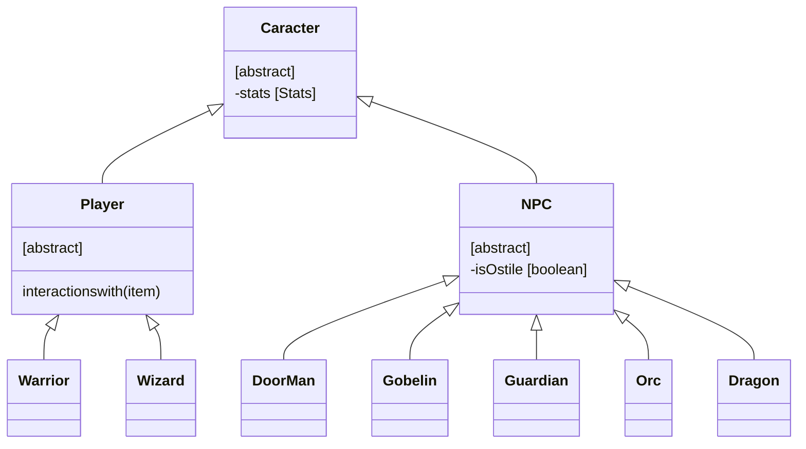
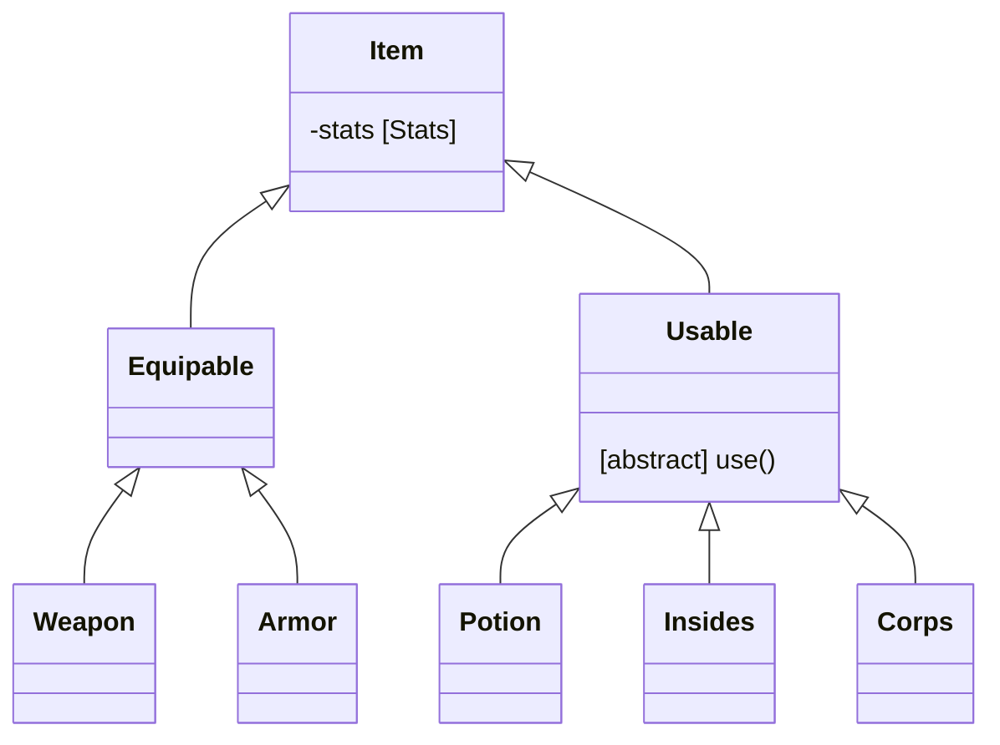
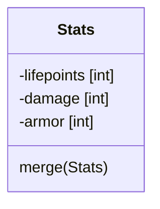

```mermaid
    classDiagram
        class NPC{
            
        }
        class Caracter {[abstract]
            -stats [Stats]   
        }
        Caracter <|-- Player
        Player <|-- Warrior
        Player <|-- Wizard
        Caracter <|-- NPC
        NPC <|-- DoorMan
        NPC <|-- Gobelin
        NPC <|-- Guardian
        NPC <|-- Orc
        NPC <|-- Dragon
        class NPC {[abstract]
            -isOstile [boolean]
        }
        class Player {[abstract]
            interactionswith(item)
        }
        class Wizard {
            
        }
        class Warrior {
            
        }
```

```mermaid
classDiagram
    Item <|-- Equipable
    Item <|-- Usable
    Equipable <|-- Weapon
    Equipable <|-- Armor
    Usable <|-- Potion
    Usable <|-- Insides
    Usable <|-- Corps
    class Item {
        -stats [Stats]   
    }
    class Weapon {
    }
    class Armor{
    }
    class Usable {
        [abstract] use()
    }
```

```mermaid
classDiagram
    class Stats {
        -lifepoints [int]
        -damage [int]
        -armor [int]
        merge(Stats)
    }
```