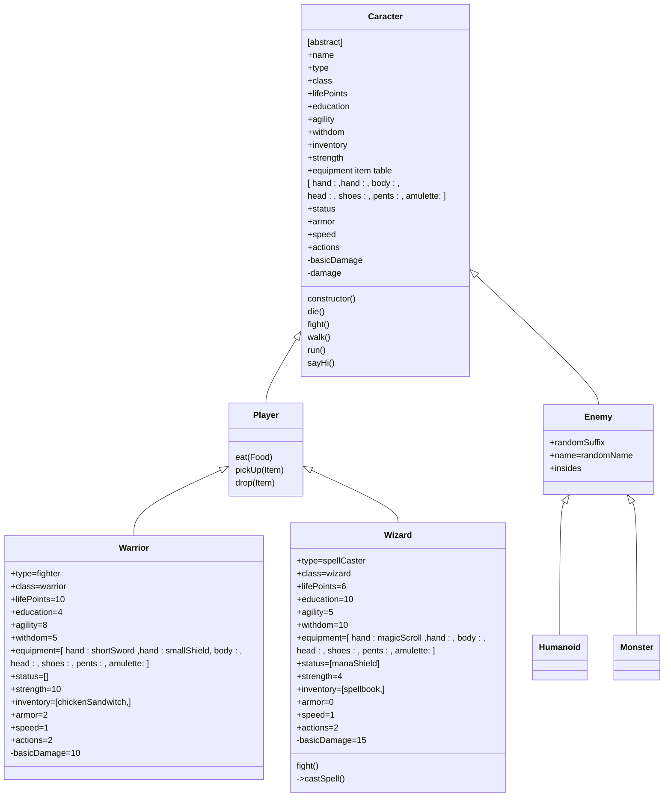
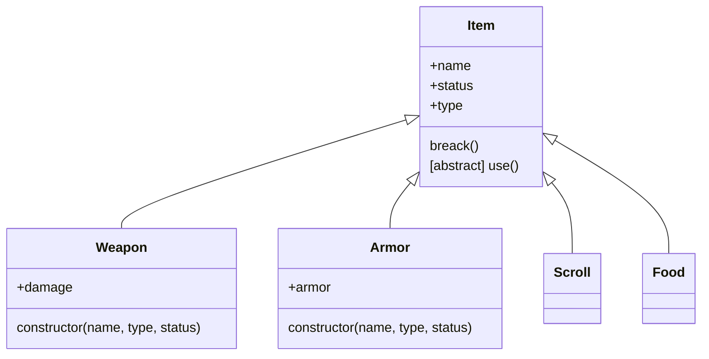

```mermaid
    classDiagram
        class Enemy{
            +randomSuffix
            +name=randomName
            +insides
        }
        class Caracter {[abstract]
            +name
            +type
            +class
            +lifePoints
            +education
            +agility
            +withdom
            +inventory
            +strength
            +equipment item table
            [ hand : ,hand : , body : ,
            head : , shoes : , pents : , amulette: ]
            +status
            +armor
            +speed
            +actions
            -basicDamage
            -damage
            constructor()
            die()
            fight()
            walk()
            run()
            sayHi()
            }
        Caracter <|-- Player
        Player <|-- Warrior
        Player <|-- Wizard
        Caracter <|-- Enemy
        Enemy <|-- Humanoid
        Enemy <|-- Monster
        class Player {
            eat(Food)
            pickUp(Item)
            drop(Item)
        }
        class Wizard {
            +type=spellCaster
            +class=wizard
            +lifePoints=6
            +education=10
            +agility=5
            +withdom=10
            +equipment=[ hand : magicScroll ,hand : , body : ,
            head : , shoes : , pents : , amulette: ]
            +status=[manaShield]
            +strength=4
            +inventory=[spellbook,]
            +armor=0
            +speed=1
            +actions=2
            -basicDamage=15
            fight()
            ->castSpell()
        }
        class Warrior {
            +type=fighter
            +class=warrior
            +lifePoints=10
            +education=4
            +agility=8
            +withdom=5
            +equipment=[ hand : shortSword ,hand : smallShield, body : ,
            head : , shoes : , pents : , amulette: ]
            +status=[]
            +strength=10
            +inventory=[chickenSandwitch,]
            +armor=2
            +speed=1
            +actions=2
            -basicDamage=10
        }
```

```mermaid
classDiagram
    Item <|-- Weapon
    Item <|-- Armor
    Item <|-- Scroll
    Item <|-- Food
    class Item {
        +name
        +status
        +type
        breack()
        [abstract] use()
    }
    class Weapon {
        +damage
        constructor(name, type, status)
    }
    class Armor{
        +armor
        constructor(name, type, status)
    }
    class Scroll{
    }
    class Food {
    }
```