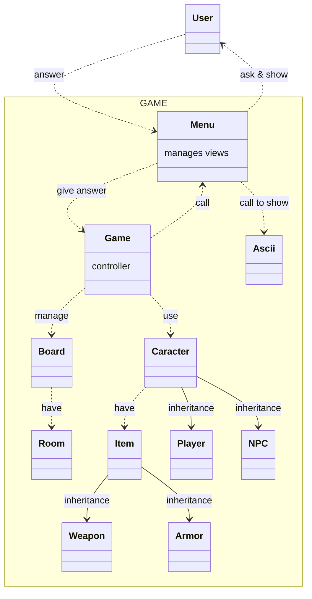

```mermaid
    classDiagram
        class User
        Game ..> Menu : call
        Menu ..> Ascii : call to show
        Menu ..> Game : give answer
        Game ..> Caracter :  use
        Game ..> Board :  manage
        Menu ..> User : ask & show
        User ..> Menu : answer
        Board ..> Room : have
        Caracter ..> Item : have
            Caracter --> Player : inheritance
            Caracter --> NPC : inheritance
            Item --> Weapon : inheritance
            Item --> Armor : inheritance
        namespace GAME {
            class Game{
                controller
            }
            class Board {
            }
            class Room{
            }
            class Menu {
                manages views
            }
            class Item {
            }
            class Weapon {
            }
            class Armor {
            }
            class Caracter {
            }
            class NPC {
            }
            class Player {
            }
            class Ascii{
            }
        }


```